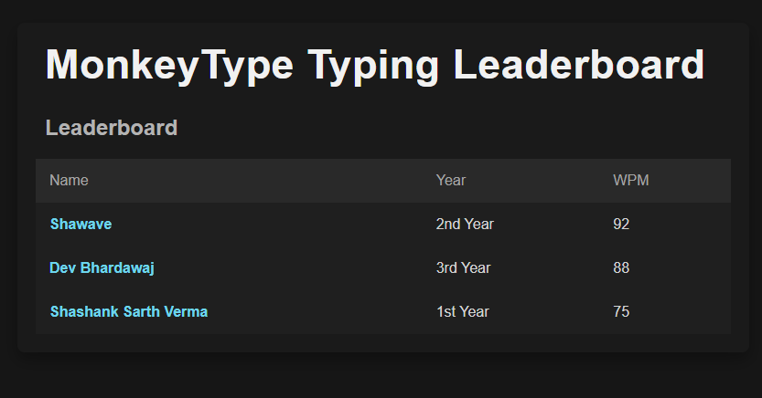
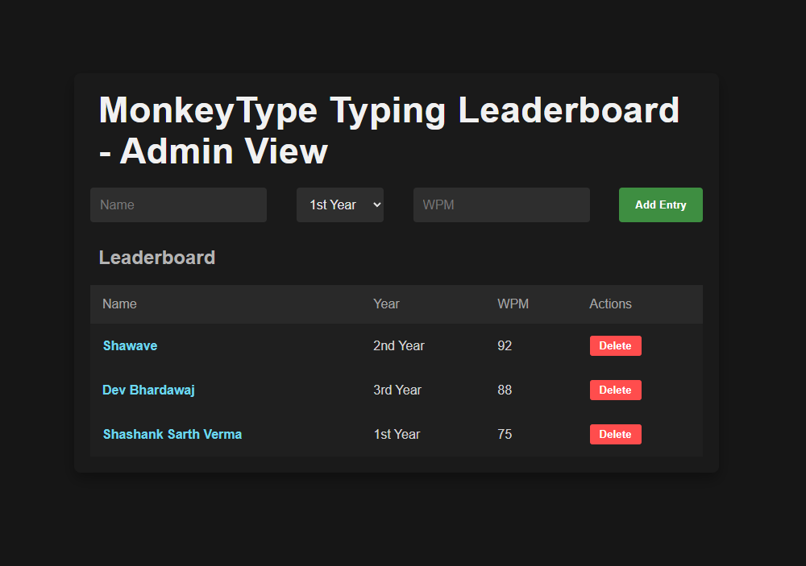
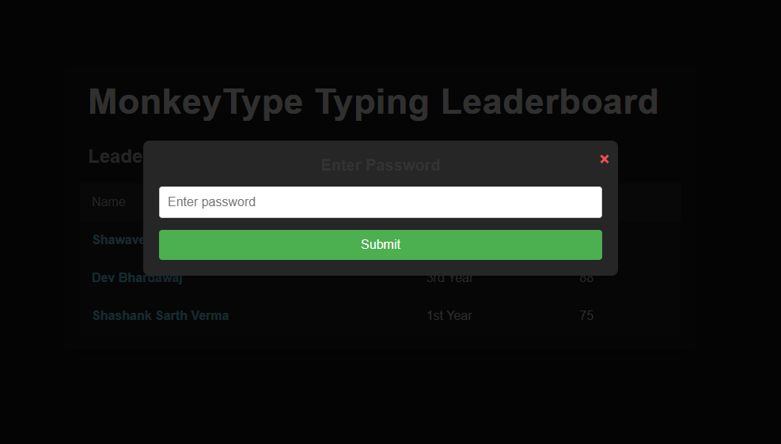

# MonkeyTyping Leaderboard

## Overview

MonkeyTyping Leaderboard is a web-based leaderboard system for tracking and displaying typing scores in the MonkeyTyping game. It provides a ranked list of players based on their typing performance.

## Features

- Displays top players with their scores
- Real-time updates
- Simple and intuitive UI

## Prerequisites

Ensure you have the following installed before running the project:

- [Node.js](https://nodejs.org/)
- npm (comes with Node.js)

## Installation

1. Clone the repository:
   ```sh
   git clone https://github.com/yourusername/monkeytyping-leaderboard.git
   cd monkeytyping-leaderboard
   ```
2. Install dependencies:
   ```sh
   npm install
   ```

## Running the Server

To start the server, run the following command:

```sh
node app.js
```

The server will start, and you can access the leaderboard in your browser.

## Screenshots

Below are some screenshots showcasing the MonkeyTyping Leaderboard:

### Home Page:



### Admin View:



### Player Stats:


### Password Protection:



## Contributing

If you'd like to contribute:

1. Fork the repository
2. Create a new branch (`git checkout -b feature-branch`)
3. Commit your changes (`git commit -m 'Add new feature'`)
4. Push to the branch (`git push origin feature-branch`)
5. Create a Pull Request
